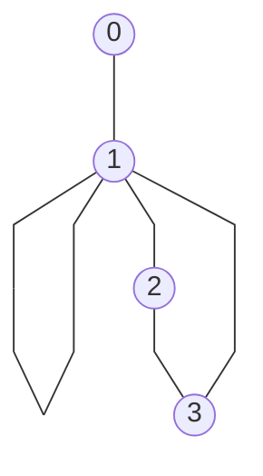

### Introduction

- Biological systems => Multiple interacting components
- Components:
    - Are not isolated
    - levels are affected by interactions
    - Form cohesive subsystems that perform specific tasks
    - Are spatially organized(cellular structures)
    - Their spatio-temporal interactions result in biological system features.

- Function of a component can be inferred from its interactions.
- Network theory and mathematical modeling are used to analyze interactions.

### Network theory

Graph: abstract representation of a set of components(nodes/vertices) where some components are connected by edges.

**Formal definition**: Graph is a pair $G = (V,E)$ such that $E \subseteq \{\{u,v\} \mid u,v \in V\}$. $V$ is the set of nodes and $E$ is the set of edges.


In context of biology:
- nodes: genes, proteins, metabolites, regulatory elements, cells, species, etc.
- edges: interactions, relations, dependencies, etc.

Network can be:
- directed or undirected
- weighted or unweighted
- simple or multigraph

For a given graph $G(V,E)$:
- Number of nodes $n = |V(G)|$
- Number of edges $m = |E(G)|$

* **Parallel edges**: two edges connect the same pair of vertices (forms a multi-edge).
* **Loops**: an edge connecting a vertex to itself.
* **Simple graph**: a graph with no parallel edges and no loops.
* **Multigraph**: a graph with parallel edges and loops.

* Weighted directed hypergraph - Nodes connected to subset of nodes

#### Graph representation on computers
* Adjacency matrix - constant time to check for an edge between two nodes
  - $A[u,v] = 1$ if $\{u,v\} \in E(G)$
  - $A[u,v] = 0$ if $\{u,v\} \notin E(G)$
  - Matrix is symmetric for a non directed graph but not for directed
* Incidence matrix
  - $A[u,e] = 1$ if $u \in E(G)$
  - $A[u,e] = 0$ if $u \notin E$
* Adjacency list - To each node, a list of neighbors/connected nodes

#### Walk
Alternating sequence of nodes and edges.

**Formally**: Let $G = (V,E)$ be a simple graph. A sequence $W = (v_1, e_1, v_2, \dots, e_{k-1}, v_k)$ with $v_i \in V(G)$, $1 \leq i \leq k$ and $e_i = \{v_i, v_{i+1}\} \in E(G)$, $1 \leq i \leq k-1$ is called a walk.

Walk is closed if $v_1 = v_k$

#### Path
Given a graph G(V,E), a walk $W = (v_1, e_1, v_2, \dots, e_{k-1}, v_k)$ is a path if $v_i \neq v_j,1 \leq i,j \leq k, i \neq j$.

A path is a cycle if $v_i = v_k$

**Minimality/Maximality**: with respect to a property of a subgraph.
**Connectedness**: A graph is connected if there exists a path between any two nodes u and v in the graph.
**Tree**: Connected graph without cycles.
**Forest**: Graph with multiple connected components without cycles. 
**Rooted Tree**: One vertex has been designated as root

### Determining connectedness
- How to traverse the graph: 
  * DFS
  * BFS

#### Depth First Search(DFS)- recursive
- Is done recursively
1. Choose a starting node v
2. Mark node v as visited
3. If node adjacent to v is not marked as visited, select as starting point
4. Perform DFS on the node
5. Return to other nodes adjacent to v and perform DFS until all neghbors of v have been visited

##### Pseusdocode:
```text
procedure dfsearch(G)
  for each v ∈ V(G) do
    mark[v] ← 0  # means node has not been visited
  for each v ∈ V(G) do
    if mark[v] ≠ 1 then
      dfs(v)
      
procedure dfs(v)
  mark[v] ← 1 # Node is now marked as visited
  for each node w adjacent to v do
    if mark[w] ≠ 1 then
      dfs(w)
```

Example execution:

```python
from graph import Graph
g = [[0,0,1,0],[0,1,0,1],[1,0,0,1],[0,1,1,0]]
graph = Graph(g)
graph.describe_graph()
graph.dfsearch(mode="recursive")
```
output:
```text
There are 4 nodes and 7 edges in this graph
Performing dfs on node 0
Performing dfs on node 2
Performing dfs on node 3
Performing dfs on node 1
DFS traversal order: [0, 2, 3, 1]
```

- Each node is visited once as the mark of its neighbors are checked. 
- Adjacency list results in a complexity of $\theta (max(m,n))$.
- DFS (recursive) results in spanning tree rooted at the starting node with edges directed based on traversal order
- For an unconnected graph results in a forest
- For a directed graph it can produce a spanning forest even if the graph is connected

#### Depth First Search(Iterative)
- Same logic but uses a stack

##### Pseudocode:
```text
procedure dfs2(v)
  P ← empty_stack
  mark[v] ← 1
  push v unto P
  while P is not empty
    while there exists a node w adjacent to top P
      such that mark[w] ≠ 1 do
        mark[w] ← 1
        push w unto P # w is the new top of P
    pop P
```
Example execution:
```python
graph.dfsearch(mode="iterative")
```
output:
```text
Performing iterative dfs on node 0
marking 2 as visited
pushed 2 to stack. New Stack: [0, 2]
marking 3 as visited
pushed 3 to stack. New Stack: [0, 2, 3]
marking 1 as visited
pushed 1 to stack. New Stack: [0, 2, 3, 1]
Stack: [0, 2, 3, 1]. popping stack
New Stack: [0, 2, 3]
Stack: [0, 2, 3]. popping stack
New Stack: [0, 2]
Stack: [0, 2]. popping stack
New Stack: [0]
Stack: [0]. popping stack
New Stack: []
DFS traversal order: [0, 2, 3, 1]
```

#### Breadth First Search

Given a starting node v, mark it as visited and visit all its immediate adjacent nodes. Find another unvisited/unmarked node until all nodes have been marked as visited.

Uses Queue as the data structure(First in first out).

Generates a tree for a connected graph and a forest for a disconnected graph.

Same complexity as DFS

Pseudocode:
```text
procudure bfsearch(G)
  for each v ∈ V(G) do
    mark[v] ← 0
  for each v ∈ V(G) do
    if mark[v] ≠ 1 then
      bfs(v)
      
procedure bfs(v)
  Q ← empty queue
  mark[v] ← 1 # node is marked as visited
  while Q is not empty do
    u ← first(Q)
    dequeue u from Q
    for each node w adjacent to u do
      if mark[w] ≠ 1 then
        mark[w] ← 1
        enqueue w into Q
```
