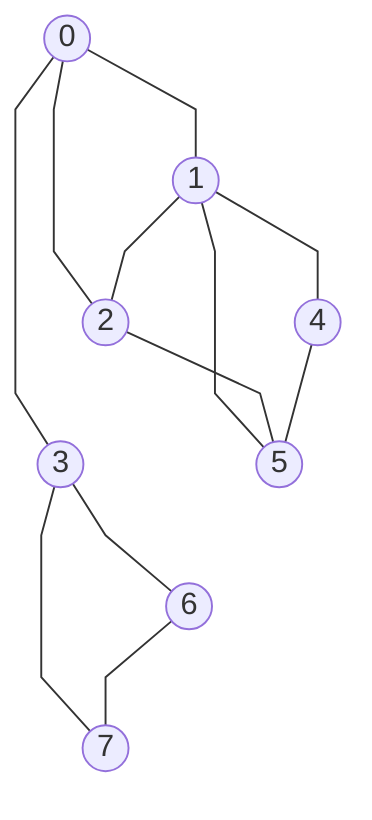

\usepackage{amssymb}
### Introduction

- Biological systems => Multiple interacting components
- Components:
    - Are not isolated
    - levels are affected by interactions
    - Form cohesive subsystems that perform specific tasks
    - Are spatially organized(cellular structures)
    - Their spatio-temporal interactions result in biological system features.

- Function of a component can be inferred from its interactions.
- Network theory and mathematical modeling are used to analyze interactions.

### Network theory

Graph: abstract representation of a set of components(nodes/vertices) where some components are connected by edges.

**Formal definition**: Graph is a pair $G = (V,E)$ such that $E \subseteq \{\{u,v\} \mid u,v \in V\}$. $V$ is the set of nodes and $E$ is the set of edges.


In context of biology:
- nodes: genes, proteins, metabolites, regulatory elements, cells, species, etc.
- edges: interactions, relations, dependencies, etc.

Network can be:
- directed or undirected
- weighted or unweighted
- simple or multigraph

For a given graph $G(V,E)$:
- Number of nodes $n = |V(G)|$
- Number of edges $m = |E(G)|$

* **Parallel edges**: two edges connect the same pair of vertices (forms a multi-edge).
* **Loops**: an edge connecting a vertex to itself.
* **Simple graph**: a graph with no parallel edges and no loops.
* **Multigraph**: a graph with parallel edges and loops.

* Weighted directed hypergraph - Nodes connected to subset of nodes

#### Graph representation on computers
* Adjacency matrix - constant time to check for an edge between two nodes
  - $A[u,v] = 1$ if $\{u,v\} \in E(G)$
  - $A[u,v] = 0$ if $\{u,v\} \notin E(G)$
  - Matrix is symmetric for a non directed graph but not for directed
* Incidence matrix
  - $A[u,e] = 1$ if $u \in E(G)$
  - $A[u,e] = 0$ if $u \notin E$
* Adjacency list - To each node, a list of neighbors/connected nodes

#### Walk
Alternating sequence of nodes and edges.

**Formally**: Let $G = (V,E)$ be a simple graph. A sequence $W = (v_1, e_1, v_2, \dots, e_{k-1}, v_k)$ with $v_i \in V(G)$, $1 \leq i \leq k$ and $e_i = \{v_i, v_{i+1}\} \in E(G)$, $1 \leq i \leq k-1$ is called a walk.

Walk is closed if $v_1 = v_k$

#### Path
Given a graph G(V,E), a walk $W = (v_1, e_1, v_2, \dots, e_{k-1}, v_k)$ is a path if $v_i \neq v_j,1 \leq i,j \leq k, i \neq j$.

A path is a cycle if $v_i = v_k$

**Minimality/Maximality**: with respect to a property of a subgraph.
**Connectedness**: A graph is connected if there exists a path between any two nodes u and v in the graph.
**Tree**: Connected graph without cycles.
**Forest**: Graph with multiple connected components without cycles. 
**Rooted Tree**: One vertex has been designated as root

### Determining connectedness
- How to traverse the graph: 
  * DFS
  * BFS

#### Depth First Search(DFS)- recursive
- Is done recursively
1. Choose a starting node v
2. Mark node v as visited
3. If node adjacent to v is not marked as visited, select as starting point
4. Perform DFS on the node
5. Return to other nodes adjacent to v and perform DFS until all neghbors of v have been visited

##### Pseudocode:
```text
procedure dfsearch(G)
  for each v ∈ V(G) do
    mark[v] ← 0  # means node has not been visited
  for each v ∈ V(G) do
    if mark[v] ≠ 1 then
      dfs(v)
      
procedure dfs(v)
  mark[v] ← 1 # Node is now marked as visited
  for each node w adjacent to v do
    if mark[w] ≠ 1 then
      dfs(w)
```

Example execution:

```python
from graph import Graph
g = [
    [0, 1, 1, 1, 0, 0, 0, 0],
    [1, 0, 1, 0, 1, 1, 0, 0],
    [1, 1, 0, 0, 0, 1, 0, 0],
    [1, 0, 0, 0, 0, 0, 1, 1],
    [0, 1, 0, 0, 0, 1, 0, 0],
    [0, 1, 1, 0, 1, 0, 0, 0],
    [0, 0, 0, 1, 0, 0, 0, 1],
    [0, 0, 0, 1, 0, 0, 1, 0],
]
graph = Graph(g)
graph.describe_graph()
graph.dfsearch(mode="recursive")
```
output:
```text
There are 8 nodes and 11 edges in this graph
Performing recursive dfs on node 0
Performing dfs on node 1
Performing dfs on node 2
Performing dfs on node 5
Performing dfs on node 4
Performing dfs on node 3
Performing dfs on node 6
Performing dfs on node 7
DFS traversal order(pre-order): [0, 1, 2, 5, 4, 3, 6, 7]
DFS tree edges: [(0, 1), (1, 2), (2, 5), (5, 4), (0, 3), (3, 6), (6, 7)]
Post order: [4, 5, 2, 1, 7, 6, 3, 0]
```

- Each node is visited once as the mark of its neighbors are checked. 
- Adjacency list results in a complexity of $\theta (max(m,n))$.
- DFS (recursive) results in spanning tree rooted at the starting node with edges directed based on traversal order
- For an unconnected graph results in a forest
- For a directed graph it can produce a spanning forest even if the graph is connected

#### Depth First Search(Iterative)
- Same logic but uses a stack

##### Pseudocode:
```text
procedure dfs2(v)
  P ← empty_stack
  mark[v] ← 1
  push v unto P
  while P is not empty
    while there exists a node w adjacent to top P
      such that mark[w] ≠ 1 do
        mark[w] ← 1
        push w unto P # w is the new top of P
    pop P
```
Example execution:
```python
graph.dfsearch(mode="iterative")
```
output:
```text
Performing iterative dfs on node 0
marking 1 as visited
pushed 1 to stack. New Stack: [0, 1]
marking 2 as visited
pushed 2 to stack. New Stack: [0, 1, 2]
marking 5 as visited
pushed 5 to stack. New Stack: [0, 1, 2, 5]
marking 4 as visited
pushed 4 to stack. New Stack: [0, 1, 2, 5, 4]
Stack: [0, 1, 2, 5, 4]. popping stack
New Stack: [0, 1, 2, 5]
Stack: [0, 1, 2, 5]. popping stack
New Stack: [0, 1, 2]
Stack: [0, 1, 2]. popping stack
New Stack: [0, 1]
Stack: [0, 1]. popping stack
New Stack: [0]
marking 3 as visited
pushed 3 to stack. New Stack: [0, 3]
marking 6 as visited
pushed 6 to stack. New Stack: [0, 3, 6]
marking 7 as visited
pushed 7 to stack. New Stack: [0, 3, 6, 7]
Stack: [0, 3, 6, 7]. popping stack
New Stack: [0, 3, 6]
Stack: [0, 3, 6]. popping stack
New Stack: [0, 3]
Stack: [0, 3]. popping stack
New Stack: [0]
Stack: [0]. popping stack
New Stack: []
DFS traversal order(pre-order): [0, 1, 2, 5, 4, 3, 6, 7]
DFS tree edges: [(0, 1), (1, 2), (2, 5), (5, 4), (0, 3), (3, 6), (6, 7)]
Post order: [4, 5, 2, 1, 7, 6, 3, 0]
```

#### Breadth First Search

Given a starting node v, mark it as visited and visit all its immediate adjacent nodes. Find another unvisited/unmarked node until all nodes have been marked as visited.

Uses Queue as the data structure(First in first out).

Generates a tree for a connected graph and a forest for a disconnected graph.

It checks the nodes by order of increasing distance from the reference/starting node, therefor it gives the shortest path fro a start node to all other nodes **(but for non-weighted graphs)**.

Same complexity as DFS

Pseudocode:
```text
procudure bfsearch(G)
  for each v ∈ V(G) do
    mark[v] ← 0
  for each v ∈ V(G) do
    if mark[v] ≠ 1 then
      bfs(v)
      
procedure bfs(v)
  Q ← empty queue
  mark[v] ← 1 # node is marked as visited
  while Q is not empty do
    u ← first(Q)
    dequeue u from Q
    for each node w adjacent to u do
      if mark[w] ≠ 1 then
        mark[w] ← 1
        enqueue w into Q
```
Example:
```python
g = g = [
    [0, 1, 1, 1, 0, 0, 0, 0],
    [1, 0, 1, 0, 1, 1, 0, 0],
    [1, 1, 0, 0, 0, 1, 0, 0],
    [1, 0, 0, 0, 0, 0, 1, 1],
    [0, 1, 0, 0, 0, 1, 0, 0],
    [0, 1, 1, 0, 1, 0, 0, 0],
    [0, 0, 0, 1, 0, 0, 0, 1],
    [0, 0, 0, 1, 0, 0, 1, 0],
]
graph = Graph(g)
graph.bfsearch()
```
output:
```text
Performing bfs on node 0
marking 0 as visited
enqueued 0. New Queue: [0]
popping 0. Queue is now []
marking 1 as visited
enqueued 1. New Queue: [1]
marking 2 as visited
enqueued 2. New Queue: [1, 2]
marking 3 as visited
enqueued 3. New Queue: [1, 2, 3]
popping 1. Queue is now [2, 3]
marking 4 as visited
enqueued 4. New Queue: [2, 3, 4]
marking 5 as visited
enqueued 5. New Queue: [2, 3, 4, 5]
popping 2. Queue is now [3, 4, 5]
popping 3. Queue is now [4, 5]
marking 6 as visited
enqueued 6. New Queue: [4, 5, 6]
marking 7 as visited
enqueued 7. New Queue: [4, 5, 6, 7]
popping 4. Queue is now [5, 6, 7]
popping 5. Queue is now [6, 7]
popping 6. Queue is now [7]
popping 7. Queue is now []
BFS traversal order: [0, 1, 2, 3, 4, 5, 6, 7]
```

### Tree traversal
- When traversing a graph and generating a spanning tree, we keep track of the order the nodes are visited.
- **Pre-order** traversal means we record the node the moment it is visited during dfs traversal
- **Post-order** traversal means we record the node after both the left and right children(or just child if one) has been visited
- Leads to the ancestry rule:
  * $pre(v) < pre(w)$ and $post(v) > post(w)$, then $v$ is an ancestor of $w$
- offers precondition with a time complexity of $\theta(1)$(constant time)

### Articulation point
- Is a vertex whose removal(as well as its incident edges) disconnects the graph

- Naive approach to determining articulation points is performing dfs on the graph with each of the nodes removed, to dtermine which ones result in more than one connected component. i.e.

Pseudocode:
```text
for every node u
  Remove node u
  Perform DFS in G - u
  If G - u is a single connected component, node u is an articulation point
```

Given that DFS with adjacency list implementation results in a complexity of:
$\theta(max(m,n))=\theta(m)$.

Naive approach requires DFS n times leading to a complexity of $\theta(nm)$ that becomes cubic for dense graphs. **INEFFICIENT!!**

#### Efficient approach
1. Apply DFS to generate DFS tree
2. Nodes visited earlier are then considered parents of later nodes
3. If a node child lacks a path(separate) to an ancestor of the particular node, removing said node would disconnect the child from the rest of the graph
4. Root is an articulation point if it has more than one child

We use the pre-order and post order numbering of nodes as visited during DFS tree construction.

For every node we solve the recurrence relation:

$highest[v] = min(pre-order[v], pre-order[w], highest[x])$

where pre-order[v] is the pre-order numbering of node v, pre-order[w] is the pre-order numbering of a node w reachable by going through a back edge that is not in the DFS tree, and highest[x] is the highest reachable node by going through a child of node v instead (taking another route to an ancestor of v)

A node v is then an articulation point if at least one of its children has no way of getting back to an ancestor of v without going through the node v

i.e. $highest[x] \geq pre-order[v]$ - The highest level node reachable from a child is lower than or equal to the node itself

Example:
```python
g = [
    [0, 1, 1, 1, 0, 0, 0, 0],
    [1, 0, 1, 0, 1, 1, 0, 0],
    [1, 1, 0, 0, 0, 1, 0, 0],
    [1, 0, 0, 0, 0, 0, 1, 1],
    [0, 1, 0, 0, 0, 1, 0, 0],
    [0, 1, 1, 0, 1, 0, 0, 0],
    [0, 0, 0, 1, 0, 0, 0, 1],
    [0, 0, 0, 1, 0, 0, 1, 0],
]
graph = Graph(g)
graph.art_point()
```
output:
```text
pre-order: [0, 1, 2, 5, 4, 3, 6, 7]
post-order: [4, 5, 2, 1, 7, 6, 3, 0]
tree-edges: [(0, 1), (1, 2), (2, 5), (5, 4), (0, 3), (3, 6), (6, 7)]
back edge: 2 -> 0
back edge: 4 -> 1
back edge: 5 -> 1
back edge: 7 -> 3
0 parent = -1 pre = 0 low = 0
1 parent = 0 pre = 1 low = 0
2 parent = 1 pre = 2 low = 0
3 parent = 0 pre = 5 low = 5
4 parent = 5 pre = 4 low = 1
5 parent = 2 pre = 3 low = 1
6 parent = 3 pre = 6 low = 5
7 parent = 6 pre = 7 low = 5

Articulation points: [3, 0]
```

- **Biconnected graph** - graph without an articulation point
    * Functionality is maintained even without any of the nodes - biological aspect would be a missing component in a biochemical reaction does not affect the process. Its absence is remedied through an alternative pathway
- **Bicoherent graph** - Every articulation point is connected by two edges to each component of remaining graph
    * Functionality is preserved even if a connection is lost(the edge only - node loss would result in loss of function). A process is not dependent on a single pathway (contigencies are available). e.g. protein that can bind to more than one enzyme ensures catalysis remains possible even if one of the enzymes is missing
    
- **Interactome** - Totallity of Protein-protein interactions that happen in a cell or organism

- Interactomes can be determined using large-scale PPI screening techniques:
    * High-throughput affinity purification with mass spectrometry - exploiting protein binding to isolate targets
    * Yeast two-hybrid assay - gene promoter activity
- Determining articulation points in PPI networks identifies lethal proteins. Their absence means non-functionality leading to death at a cellular and organismal level

### Network Properties

- Network properties are network invariant (do not depend a particular drawing of the graph)
    * Properties are preserved in isomorphic networks

#### Isomorphism
- two graphs are isomorphic if there is a one-to-one mapping(bijection)

i.e. $\varphi: V(G) \rightarrow V(H)$ such that ${u, v} \in E(G)$ if and only if ${\varphi(u),\varphi(v)} \in E(H)$

$\varphi$ being the mapping function that maps the vertices and edges of graph G to graph H

#### Classification of network properties
- is it on a subset of nodes/edges or the entire network?
- which information is needed to dtermine the property: local info about node/edge or global network info?

These criteria classify a property as:
  - Local: pertaining to a subset of nodes/edges, info on nodes/edges is enough to calculate
  - Global: property arising from the entire network
  - Local-global: Pertains to subset of nodes/edges but needs info from whole network to calculate
  
### Seminal network properties

#### Node degree (local property)

For an undirected graph $G$, node degree of a node $u$ is the number of edges incident on the node, denoted by $d(u)$

For a directed graph $G$, a node has both indegree (number of incoming edges) and out degree(number of outgoing edges) denoted by:
  * $d^{-}(u)$ for indegree (0 if $u$ is a source node)
  * $d^{+}(u)$ for outdegree (0 if node $u$ is a sink node)
  
For an undirected graph:
$\sum_{u \in V(G)}d(u) = 2m$

- A node that is not a sink or a source node is an internal node
- if for every $u, d^{-}(u) = d^{+}(u)$, the graph is balanced

#### Degree Sequence
Given a graph G, degree sequence is a non-increasing(decreasing) sequence of node degrees

**When is a degree sequence graphic?**

1. A degree sequence $S$ is graphic if one can find a simple graph which has S as its degree sequence

2. **Havel and Hakimi**:
    * A degree sequence $\\{d_1,\dots d_n\\}$ with $n \geq 3$ and $d_1 \geq 1$ is graphic if and only if the sequence $\\{d_2 - 1, d_3 - 1,\dots,d_{d_1 + 1} - 1, d_{d_1 + 2},\dots, d_p\\}$ is graphic
      1. starting with the first node of degree d in the degree sequence, remove it and subtract 1 from the next d entries
      2. repeat the same for the resulting sorted sequence
      3. A Sequence then becomes not graphic if at any point the result of subtraction is -1 or if the final sequence is not empty
    * A degree sequence is not graphic if all node degrees occur with a multiplicity of 1 (there must be at least two nodes of same degree) i.e. {4,2,3,1} is not graphic
    
3. **Erdos-Gallai theorem**:
    * A sequence is graphic if and only if:
      * $\sum_{i=1}^n d_i$ is even - sum of all node degrees is even
      * $\sum_{i=1}^k d_i \leq k(k-1) + \sum_{i=k+1}^n min(d_i,k)$ holds for every $k, 1 \leq k \leq n$
        - given a graph, we consider nodes of k largest degrees(1, 2, 3...k highest degrees)e.g. {4, 3, 3, 3, 3, 2, 2, 2}; the 3 largest degrees would be the first 3 node degrees 4, 3, 3
        - How many edges the nodes collectively demand = 4 + 3 + 3 = 10 i.e. $\sum_{i=1}^k d_i$
        - Can this requirement be satisfied by the available connections: connections between the nodes themselves( $k(k-1)$ ) + connections to other remaining nodes( $\sum_{i=k+1}^n min(d_i,k)$ )
 * The two theorems have some similarities in that Havel Hakimi checks that the condition holds for a node degree at a time but for all node degrees, and Erdos Galai checks the condition for k largest node degrees at a time, and has to hold for every k from 1 to the numrber of elements in the degree sequence/total number of nodes
 
**Isomorphic graphs** have the same degree sequence but not every graph with same degree sequence are isomorphic; same case for degree distribution

#### Degree distribution

specificies the probability that a randomely chosen node is of degree k. i.e. 

$P(d(u)=k) = \frac{|{u|d(u)=k}|}{n} = \frac{n_k}{n}$ where $n_k$ is the number of nodes of degree k

#### Networks types based on degree distribution

**Erdos-Renyi**: applys to regular/almost regular graphs whose degree distribution follows a poisson distribution
  - For an Erdos-Renyi graph, the expected number of edges for the graph is given by $E[m]=\frac{n(n-1)}{2}p$ while the expected average degree of nodes is given by $E[d(u)]=(n-1)p$ where $n$ is the number of nodes and $p$ is the probability of the edge $(u,v)$ being in the graph $G$

**Preferrential attachment(Barabasi-Albert)**: applies to graphs whose degree distribution follows power law
  - Nodes with already higher degrees are more likely to get more new edges from each new node $u$ added to graph $G$
  - Graph have scale invariance
  - Networks have some nodes as hubs(having higher degree)
  
#### Graph density(global property)

**Absolute density** is the number of edges with respect to the possible number of edges on an $n$ node network. i.e.

$\delta(G) = \frac{m}{\frac{n(n-1)}{2}} = \frac{2m}{n(n-1)}$

In words:
  - $density(\delta) = \frac{\text{actual edges}}{\text{maximum possible edges}}$

**Relative density** is the average number of edges per node(and corresponds to average degree). i.e.

$\overline{d}(G)=\frac{\sum_{i=1}^n n_i}{n} = \frac{2m}{n}$

#### Clusterdness

Some networks have denser neighborhoods than others

Determined using:
  - clustering coefficient
  - transitivity(triangles)
  - matching index
  
##### Clustering coefficient
**Neighborhood** of a node $u$ consists of nodes that are a specied distance away from the node
  * First neighborhood $\rightarrow$ neighboring nodes that are distance 1 away from node $u$
  * $k^{th}$ neighborhood $\rightarrow$ neighboring nodes that are distance $k$ away from node $u$
    * $N^k(u)$ - BFS can be used here, floyd's all pairs shortest paths can also be used here
    
**Node induced subgraph** is a graph induced by a subset of nodes.
  - Given graph $G=(V,E)$, subgraph $H$ induced by node subset $V' = V(H)\subseteq V(G)$ such that for every $u,v \in V(H)
    - ${u,v} \in E(H) \text{if and only if} {u,v} \in E(G)$
    - $H = G[V']$

**Clustering coefficient**(determined from the first neighborhood of a node) is then:
  * let $G_u$ denote the frst neighborhood induced subgraph from neighbors of node $u$. i.e. $G_u = G[N^1(u)]$
  * Clustering cofficient of node $u$ is then: $C(u)= \frac{|E(G_u)|}{\frac{|V(G_u)|(|V(G_u)|-1)}{2}} = \frac{2|E(G_u)|}{|V(G_u)|(|V(G_u)|-1)}$
  * or in words: $C_u = \frac{\text{number of edges between neighbors of u}}{\text{maximum possible edges between the neighbors of u}}$
  
The clustering coefficient of the graph is then obtained as an average of the clustering coefficients of all nodes in the graph. i.e.
  * $C(G) = \frac{1}{n}\sum_{u \in V(G)}C(u)$

Dangling nodes(nodes of degree one-tree leaf) create a problem for clustering coefficient. 

Denominator would be 1(1-1) = 0 and division by 0 is not allowed, so they are assigned a clustering coefficient of 0

##### Transitivity(globoal property)
Given graph $G$, $c_3$ denotes the number of 3 node cycles and $p_3$ denotes the number of 3 node paths(even 3 nodes connected by 2 edges. e.g. A - B - C is a $p_3$). Transitivity is then:
  * $T(G) = \frac{3c_3}{p_3}$ *multiplication by 3 because each traingle has 3 possible centers*
  
*Averaging with clustering coefficient treats all nodes the same even though some nodes have significantly more information on connectivity that transitivity captures*

##### Matching index
How similar are two pairs of nodes?

This similraity is obtained with respect to the immediate neighbors they share(first neighborhood)
  * Functionally related compenents may not be directly related but share common neighbors, e.g. two proteins may not directly interact in a chain of reactions but may share a reation with a third protein

given by:

$M(u,v) = \frac{|N^1(u) \bigcap N^1(v)|}{|N^1(u)|+|N^1(v)|-|N^1(u) \bigcap N^1(v)|}$

In words:  $M(u,v) = \frac{\text{shared first neighbors between two nodes}}{\text{sum of the first neighborhoods of the two nodes} - \text{shared first neighbors between the two nodes}}$

### Assortativity

The goal is to capture:
  * high degree node - high degree node adjascency
  * high degree node - low degree node adjascency
  * lack of adjascency between low degree nodes
  
Given a node $u$ and its neighbors, $s(u)$ denotes denotes the average degree of first neighbors of $u$ i.e.
  - $s(u) = \frac{\sum_{v \in N^1}d(v)}{d(u)}$

or in words
  - $s(u) = \frac{\text{sum of degrees of first neighbors of u}}{\text{degree of node u}}$

And the resulting values for each $u$ can be store in a vector i.e. $[s(u_1),s(u_2), \dots ,s(u_n)]$

And with the vector of degrees for all nodes in the graph i.e. $[d(u_1),d(u_2, \dots ,d(u_n))]$, we can calculate the Pearson correlation coefficient $r$ from the two vectors

And the correlation interpreted as:
  * $r > 0$ then the network is assortative i.e. high degree nodes tend to be adjascent to high degree nodes
  * $r < 0$ then the network is disassortative i.e. high degree nodes tend to be adjacent to low degree nodes
  * $r = 0$ then there is no trend between the node degrees
  
### Distance(local-global)

Distance between two nodes $u$ and $v$ in a network $G$ is given by length of the shortest path between the two nodes if it exists, otherwise considered $\infty$ if not existing 

Pertains to two nodes but network information is needed as shortest path may pass through one or multiple other nodes, hence **local-global**.

#### Average path length(characteristic path length)
- Is the average distance bewteen any pair of nodes.
- Given by:
  - For undirected graph:
    - $l(G) = \frac{\sum\limits_{u,v \in V(G)}d(u,v)}{\frac{n(n-1)}{2}} = \frac{2\sum\limits_{u,v \in V(G)}d(u,v)}{n(n-1)}$
  - For directed graph:
    - $\frac{\sum\limits_{u,v \in V(G)}d(u,v)}{n(n-1)}$
    
**Eccentricity** of a node $u$ is simply the maximum distance to any other node $v$. i.e.
  * $e(u) = max_v d(u,v)$
  
**Radius** of a graph is then given by the smallest eccentricity. i.e. 
  * $R(G) = min_{u \in V(G)}e(u)$

**Diameter** of a graph is then given by the largest eccentricity. i.e.
  * $D(G) = max_{u \in V(G)}e(u)$

**Distance calculation:**
  - Floyd's algorithm - on weighted non-negative graph with distances of 0 modified to infinity(unreachable) in the distance matrix
  * Pseudocode
  ```text
  function Floyd(A[1...n, 1...n])
    array D[1...n, 1...n]
    for k ← 1 to n do
      for i ← 1 to n do
        for j ← 1 to n do
          D[i,j] = min{D[i,j], D[i,k] + D[k,j]}
    return D
  ```
  
  - BFS - on non-weighted graphs for calculating length of shortest paths between a source node and every other node
  - works with two arrays: 
    * dist[] for storing the length of the shortest path from source -initialized to infinity for all entries but the source = 0
    * paths[] for storing number of shortest paths from the source - initialized to 0 for all entries but the source = 1
  * Pseudocode
  ```text
  Perform BFS from source u
  For every neighbor v of w, where w is visted in BFS
  if dist[v] > dist[w] + 1
    dist[v] = dist[w] + 1
    path[v] = path[w]
  else if dist[v] = dist[w] + 1
    path[v] = path[w] + path[v]
  ```
  - Every node is used as a source(like djikstra's for all pairs shortest paths)
  
### Centrality

- Centrally located nodes in a network may be important/essential to network function
- essentiality exists even with lack of articulation points
- biological approaches involve: knockouts, multiple experiments under varying conditions (labor intensive and time consuming)
- centrally located proteins have evolved slowly and are essential for survival
- There is evidence of cerrelation(0.75) between the degree and essentiality

**How is centrality established?**
1. Based on position of node in network
2. Based on centrality of neighbors
3. combination of measures
4. combination fo networks and high throughput data

#### 1. Centrality based on position in network
**Degree centrality** - equivalent to degree

**Eccentricity centrality** - graph centrality (Hagge & Harary, 1995)
  * $C_{ecc}(u) = \frac{1}{e(u)}$
  * is the inverse of eccentricity
  * small eccentricity means high centrality(more nodes close to node in question) and vice versa
  
**Closeness centrality** - Sabidussi, 1966
  * $C_{close}(u) = \frac{1}{\sum\limits_{v \in V(G)} d(u,v)}$
  * inverse of the sum of distances from node $u$ to all other nodes
  * Node is more central if the distance to all other nodes is smaller
  
**Stress centrality** - sum of of shortest paths that pass through a node $u$. i.e.
  * if $\sigma_{st}$ is the number of shortest paths between nodes $s$ and $t$
  * and $\sigma_{st}(u)$ is the number of shortest paths between nodes $s$ and $t$ passing through node $u$
  * stress centrality is given by:
    - $C_{stress}(u) = \sum\limits_{s \neq t \neq u \in V(G)} \sigma_{st}(u)$
    
**Betweenness centrality** - is then the number of shortest paths passing through a node $u$ as a fraction of the shortest paths connecting all nodes in the graph. i.e.
  * $C_b(u) = \sum\limits_{s \neq t \neq u \in V(G)} \frac{\sigma_{st}(u)}{\sigma_{st}}$
  * Node of high centrality lies on considerable fraction of paths connecting other nodes
  
**Bellmans criterion**
  - Node $u$ is on shrortest path between $s$ and $t$ iff $d(s,t) = d(s,u) + d(u,t)$
    * $\sigma_{st}(u) = \sigma_{su} * \sigma_{ut}$ if $d(s,t) = d(s,u) + d(u,t)$ and $\sigma_{st}(u) = 0$ otherwise
    
    *Betweenness can be detremined by combining BFS and Floyd's algorithm*

### Determining walks of length l
- Adjacency matrix gives the number of walks of distance 1 between any two nodes(if there exists an edge)
- A walk of distance 2 would then be obtained by combining any two walks of distance 1 that share a starting and ending node.
i.e.
  * $a_{ij}^2 = \sum\limits_{k=1}^n a_{ik} * a_{kj}$
  * simply counts the number of walks of length 2 between the nodes $i$ and $j$ by multiplying the two entries for walks through an intermediate node
 
- For a walk of length $l$, this is generalized to
  * $a_{ij}^l = \sum\limits_{k=1}^n a_{ik}^{l-1} * a_{kj}$
  * to count the combination of walks from i to k and from k to j
  
  *It is not important that it is the shortest length*
  
#### 2. Centraliy based on neighbors
*A node $u$ is central if its neighbors are central*

**Collinearity** - two vectors are collinear if there exists a scalar \lambda such that $x = \lambda y$

**Eigenvector** of a square matrix $A$ is a non-zero vector $v$ that changes by a scalar factor when multiplied by the matrix, i.e.
  * $Av = \lambda v$, $\lambda$ being the eigen value
  * The vector $w$ given by $Av$ and the vector v are then collinear
  * The entries of $w$ are then given by:
    - $w_i = \sum\limits_{j=1}^n a_{ij}v_j$ which is also equal to $\lambda v_i$,
    - $w_i = \sum\limits_{j=1}^n a_{ij}v_j = \lambda v_i$
    - $\sum\limits_{j=1}^n a_{ij}v_j - \lambda v_i = 0$
    - $(a_i - \lambda e_i)v = 0$ where $e_i$ is the $i^{th}$ row of an Identity matrix $I$
    - $(A - \lambda I)v = 0$
    - There exists a non-zero $v$ if and only if $(A - \lambda I)$ is not invertible, i.e. if its determinant is 0
  * Solving for eigen values of a square matrix results in multiple eigen values, but of interest in the context of eigen value centrality is the leading eigen value, i.e. the eigen value with the largest absolute value, based on Perron-Frobenius theorem

- Every non-negative real square matrix $A$ can be associated a directed graph such that
  * A positive element $a_{ij} > 0$ corresponds to a directed edge from node $i$ to $j$ of weight $a_{ij}$
- Matrix $A$ is ***irreducible*** if the corresponding directed graph is strongly connected

**The Perron-Frobenius** then states that if $A$ is an *irreducible* non-negative square matrix, then the principle eigenvalue is simple(occurs once if more then one eigen value) and is associated with a unique eigenvector whose components are all positive

Eigenvector centrality factors in neghbor centrality when defining centrality of a node $u$.

A node $u_i$ is central if its neighbors are central.
  * Let $\varphi (u_i)$ denote centrality of a node $u_i$
  * the centrality is then an eigen vector problem, i.e.
    * $\varphi (u) = \frac{1}{\lambda}A \varphi (u) \rightarrow A \varphi (u) = \lambda \varphi (u)$
    * where $\varphi$ is a vector of the centrality of each node obtained from the leading eigen vector

*start with the adjacency matrix(square irrideucible matrix with non-negative entries), use it to get the eigen values, based on Perron-frobenius select the leading(largest absolute value) eigen value and get its eigen vectors, and the entries of the eigen vectors are the eigen value centrality scores of each node based on the centrality of its neighbors*

#### Generalizations and variations of eigen value centrality
**Bonacich centrality**
- controls the contribution of neighboring nodes to the centrality score of a node using $\beta$ and $\alpha$ parameters
- Centrality of a node is influenced recursively by neighboring nodes and therefore propagates through walks of varying length
- Does not depend on eigen vectors/values but weights the contribution of the centralities of neighboring nodes through their distance from the node of interest in the form of number of walks i.e. $\beta^l$
  * $\varphi(\alpha,\beta) = \alpha(I - \beta A)^{-1}a1$
  * where 1 is a column vector of ones
  * $\alpha$ parameter affects the length of the centrality vector, can be selected so square length of vector corresponds to order of network
  * $\beta$ is the attenuating effect of neighbors
***As $\beta$ approaches the inverse of the leading eigen value, Bonacich centrality converges to eigenvalue centrality***

***$\alpha$ and $\beta$ are constants that are selected***

Based on the Neumann series, Bonacich centrality can be rewritten as 
  * $\varphi_{\alpha,\beta} = \alpha \sum\limits_{n=0}^{\infty} \beta^n A^{n+1}1$

**Katz centrality**
- A nodes centrality is based on the centralities of other nodes that can reach it
- Only relvant walks are walks from node j to i, how reachabel is the node from other nodes given a directed graph
- Longer walks contribute less because of multiplication by an attenuation factor $\beta^l$
  * $C_l(u_i) = \sum\limits_{l=1}^{\infty}\sum\limits_{j=1}^n \beta^la_{ji}^l$
  * where $\beta$ is an attenuation factor in (0,1)
  
**Page rank**
- In page rank, a value x(u) is assigned to each node
- Each node then distributes this value equally to nodes connected through its outgoing edges such that each recieving neighbor gets 
  * $\frac{x(u)}{d^+(u)}$(value of node divided by no. of receiving neighbors)
- Each node also simultaneously recieves the values distributed from nodes connected by incoming edges making the value of a node $u$ at each iteration
  * $x(u) = \sum\limits_{v \in N^{1,-}} \frac{x(v)}{d^+(v)}$
- The distribution proceeds until convergence(changes become negligible)
- Each state/iteration $t$ of the pagerank distribution has a probability $x_t^i$ which gives the probability of being at node i at the respective iteration(after $t$ steps)
- For all nodes the values at each iteration are then in the vector $x_t$ and the subsequent iteration is then 
  * $x_{t+1} = x_tP$
  * which means the vector at the next iteration is given by the vector at the current one * the probability of distribution
  * if $x_{t+1} = x_t$ then distribution is stationary (P is 1 since 1 * x_t = x_t)
- $P$ is a matrix given by $D^{-1}A$ where $D_{out}$ is a diagonal matrix of out-degrees for all nodes in a directed graph $G$ and A is the associated adjacency matrix of the graph
  * *The inverse of D is just the diagonal entries in inverse form i.e. 3 to* $\frac{1}{3}$
- $P$ is the adjacency matrix of the weighted graph with every weight corresponding to the probability of moving from one node to an outneighbor if all out edges are of equal probability to be chosen, and every row of P sums up to 1
  * probability of being in a new state = probabilty of being in a previous state $\times$ the probability of moving to the new state
- sink nodes and cycles however create a problem because movement to another node is then not possible.
- A modified weighted graph is then used such that
  * $P\alpha = \alpha P + \frac{1}{n}(1 - \alpha)E$ where E is a matrix of ones(1's) so the initial P matrix is simply modified
  * which essentially means the random walker moves to a neighborhood with probability $\alpha$ and/or jumps to a random node with probability $(1 - \alpha)$
  
- pagerank is then a vector with the probability scores for each node, which are also the pagerank centrality scores

#### 3. Combinations of centrality measures
- Use different centrality measures by combining them through multivariate statistical analysis
- combining centrality scores can be useful fo predicting gene/protein essentiality
- Principle Component Analysis(PCA) is used for this purpose

**PCA**
- Dimentionality reduction tool
- Reduces a large set of possibly correlated variables(centrality scores) into a smaller set of uncorrelated variables without loss of information
- Seeks a linear combination of the variables such that maximum variance is extracted, removes unexplained variance and seeks another linear combination
- PCA can be used on a data matrix with nodes as rows and centrality scores from diffrnet centrality measures as columns(variables)
- PCA steps:
  1. Center each variable in the data set
    * simply take the mean of each column and subtract from each column entry(centering around the mean)
  2. compute covariance matrix of the centered variables
    * pairwise covariance between each column/variable is calculated to compute the covariance matrix, with diagonal entries being the variances
  3. computes eigenvalue decomposition fo the covariance matrix
    * Simply calculate the eigen values of the resulting covariance matrix and the associated eigen vectors, i.e.
      * $(matrix_{cov} - I\lambda)v = 0$
  4. Sort eigen values highest to lowest, their corresponding eigen vectors are the principle components
    * The loading matrix is obtained from a $(p \times k)$ matrix i.e. k eigen vectors with respect to ordered eigen values, and k being the required number of principle components that captures the most variance
  5. Data with reduced variables is then obtained by the product of centered variables($n \times p$ matrix) and matrix of k leading eigen vectors

### Statistical significance of network properties
- Statistical significance tells us if a network property is biologically relevant
- To be statistically significant we need to be able to reject the null hypothesis
  * **Null hypothesis** is what is assumed to be true until evidence indicates otherwise
    * The null hypothesis tells us that the observed data would still be observed with high likelihood if the networks(data) were randomized, so we can decide if the observation is statistically significant
    * A statistically significant observation therefore occurs with low frequency in a random scenario which is expressed by the emperical p-value(fraction/percentage of occurences of observed data in a randomized dataset)

- **P-value** is the probability of an observed result assuming that the null hypothesis is true(usually the extreme observation)
- P-value requirements:
  * the value of the statistic for the data(t, chi, rank sum)
  * distribution of the statistic under null hypothesis which is specified by:
    * theoretical probability distribution of the statistic(represents an approximation)
    * permutation/randomization to approximate the distribution - gives emperical approximation of the null distribution
      - **permutation test**: involves permuting the labels of data points and recalculating the statistic (needs more than one groups of data points, when ther's usually only one network)
      - The aproaches should be able to generate new properties while low level properties(number of nodes/edges, degree sequence) are maintained
      - There should also be no bias i.e. each random network of the same degree sequence has an equal probability of being generated
        * Switch randomization
        * configuration/pairing/stub matching

#### Stub matching
Given a degree sequence:
1. Associate as many stubs(half edges) to a node as a degree from the sequence
2. Label the stubs
3. The stubs are then randomly paired to form edges
Results in multiple random networks that share the same degree sequence, no. of nodes and number of edges

#### Switch randomization
Given a graph
1. Randomly sample two edges
2. Switch the edges such that they swap an endpoint to each other
3. repeat multiple times
Also results in multiple random networks that maintains number of nodes and edges

Issues:
  * sampling two edges that share an endpoint and switching them creates loops
  * sampling two edges that don't share an endpoint but have adjacent endpoints creates a multiedge after switching
  *stub matching also can generate multigraphs with loops and multi-edges unless additional constraints are enforced*

Given the possibility of generating multiple classes of graphs after randomization, the set constraints determine what can be included in the null distribution, and more restrictive constraints result in a more biased null distribution


#### Unbiased network randomization
- Given a network $G$, a set of all possible randomizations is given by $P(G)$
- Each element in $P(G)$ is a network of the same order, size, and degree sequence as $G$
- Two elements $G_i$ and $G_j$ are then adjacent if one can create the other by a switch operation
  * the precursor network and the new resulting network are then said to be connected by an edge(created by the fact that they are the same except for a switched edge)
- The resulting set of possible randomizations is then a larger network with its nodes being the random networks generated (***Network of Networks***).
- Networks/subnetworks are to be sampled from the set $P$ such that they meet the required constraints, and some subnetworks of $P$ being more connected than others would mean a specific group of connected networks are sampled more than others, resulting in a bias - which we want to avoid
- solution is a regular Network of networks, wher every node has the same number of incoming and outgoing edges, giving a uniform stationary distribution, and every possible network is samled with equal probability, i.e.
  * $x = xP$ where $x$ is the probaility of being in a state during a random walk, and P is the transition matrix
  * So even after transitioning from one state/node to the next, the probality of being at either nodes when taking the next step in the walk is the same, so even a network that was already sampled can be resampled
  * stationary distribution(probability) is given by the inverse of node degrees
  
#### Applications of network randomization
- Determining if nodes of particular degrees, $k_1$ and $k_2$ are more adjacent than expected by chance
- Determining assortativity/ disassortativity of biological networks
- $\dots$


## Cells to GRNs

- Cells react to encironmental stimulus/signals by synthesizing task specific proteins
- The pathways involved make up the transcriptional regulatory network involving DNA, RNA, ad proteins(both target proteins and regulatory proteins)
- Proteins that influence trasncription of protein genes are **transcription factors** and they bind to promoter regions of protein encoding genes to allow transcription to take place

### Gene regulatory networks
- Gene can encode for a transcription factor or another protein(enzymes e.t.c.)
- Transcription factors modulate/regulate expression rate(transcription by RNA polymerase to produce mRNA) of genes
- TF activation happens quickly relative to downstream gene expression responses(is therefore considered to be at steady state)
- In representing these networks, we can either only consider the genes, or consider genes and their products(proteins)

**Only genes considered**
  * In this case edges would be interactions(regulatory) between TF encoding genes and other genes
  * TF-coding genes can also regulate other TF-coding genes resulting in a regulatory cascade
  * The edges are directed(regulator to target); have magnitude(regulatory strength); and have sign (+ve for activation and -ve for repression)
  * A TF can regulate multiple genes , represented by multiple outgoing edges, and can also be regulated by multiple TFs, represented by multiple incoming edges
  - The network can receive external signals from the environment, affecting TF activity and resulting in signal propagation

**Genes and Proteins considered**

- Leads to a bipartite network model

#### Bipartite network model
- Is a graph $G$ whose node-set $V(G)$ can be partitioned into two sets $V_1(G)$ and $V_2(G)$ such that all the graph edges are incident on either side of the partition, i.e. on a node in $V_1(G)$ and a node in $V_2(G)$
***Graph cannot be bipartite if it has a cycle with odd number of edges, but can be if it has even number of edges***
  * The bipartite property is broken if an edge begins from a node in set $V_1(G)$ and ends in the same node set(same for $V_2(G)$ )
- In a GRN these partitions represent proteing and Genes(both form the same network but can be partitioned)
- They can then be studied by:
  * **comparing node properties** - which nodes are important for signal propagation(hub nodes with wigh degree centrality)
  * **Degree distributions** - evolution of GRNs; revealing duplication patterns in GRN structure
  * **Distribution of paths** - for signal propagation
  
#### Network Motifs
- A network motif is a subnetwork/pattern which occurs in a network more often than in randomized networks
- The high frequency of occurence of these patterns in real networks implies functional significance
- Allows decomposision of a network represented system into smaller modules

##### Classes of Network Motifs
**Negative autoregulation**
  * The gene product represses its own promoter(binds to promoter site and prevents an activator, turning off its own transcription)
  * leads to response acceleration - production of a protein is steady until it reaches a threshold that triggers repression which happens faster, then production gradually increases again towards the threshold
  * increased stability of gene product against noise
  * has a simple mathematical model

**Positive autoregulation**
  * slows response - amount of target protein grows gradually until it reaches threshold for self activation that just maintains its production
  * creates bimodal distributions(bistability - where some cells have high and others low expression)

#### Feed forward loops
- Outlines the relationship between aregulator X, a gene Y which is regulated by X and a gene Z regulated by both X and Y
- Given both activator and repressor activity of regulators, there $2^3 = 8$ possible FFLs
  * **Coherent** - both pathways achieve the same outcome
  * **Incoherent** - pathways have opposite outcomes
  
#### How to find network motifs
**By Concentration**
  * If $N_i$ is the number of $n$-node subnetworks of type $i$ and $\sum\limits_i Ni$ is the number of $n$-node subnetworks, concentration of the subnetworks of type $i$ is given by
    * $C_i = frac{N_i}{\sum\limits_i Ni}$
    * Given a specific type of FFL, what is its number as a fraction of all present/possible 3-node subnetworks

* After determining the concentration of the FFL in the network, we then have to find out if we would get the same from randomly sampled 3 node induced subnetworks
  *A probability based correction factor(for the probability of appearance of a particular network) is necessary to avoid bias*
* How do we get these randomized subnetworks?
  1. Randomly select a starting point(edge if edge induced, node if node induced)
  2. Grow the subnetwork by adding edges(random adjacent edge if edge induced, random edge incident to the existing subgraph and not the starting node if node induced)
  3. Stop when desired number of nodes is achieved
  
#### Finding the motifs
**MCIS**
  - A maximum common induced subgraph of two graphs $G$ and $H$ is a subgraph that occurs in both $G$ and $H$ with as many vertices as possible(without breaking the commonness)
  - If a motif $H$ appears in a graph $G$, and we are trying to find the maximum common induced subgraph for the two, then $H$ is already the MCIS for both $G$ and $H$.
**MCES**
  - Is a graph subgraph of two graphs $G$ and $H$ that contains as many edges as possible such that the resulting subgraphs are isomorphic

*MCIS and MCES are both NP hard. additional operations required*

**Graph cartesian product**
  - Given two graphs $G_1 = (V_1, E_1)$ and $G_2 = (V_2, E_2)$, their Cartesian product $J = G_1 \boxdot G_2$ is a graph with nodes set $V_1 \times V_2$ and $u = (u_1, u_2)$ adjacent with $v = (v_1, v_2)$ if $u_1 = v_1$ and $(u_2, v_2) \in E_2$ or $u_2 = v_2$ and $(u_1, v_1) \in E_1$
    * in the graph cartesian product, node pairs are adjacent if they share(have the same) a node component from one graph(one of the original graphs), and have the other two components adjacent in their original graph

**Modular graph product**
  - Given two graphs $G_1 = (V_1, E_1)$ and $G_2 = (V_2, E_2)$, their Modular product $J = G_1 \odot G_2$ is a graph with nodes set $V_1 \times V_2$ and $u = (u_1, u_2)$ adjacent with $v = (v_1, v_2)$ if $(u_1, v_1) \in E_1$ and $(u_2, v_2) \in E_2$ or $(u_1, v1) \notin E_1$ and $(u_2, v_2) \notin E_2$
    * in the modular graph product, node pairs are adjacent if their components were both adjacent in their original graphs, or if none of their components were adjacent in their original graphs
    * The MGP therefore outlines how two graphs map onto each other, where a node pair in the MGP shows which node in $G_1$(first component in the node pair) corresponds to which node in $G_2$(second component in the node pair) and their respective edges showing the "isomorphic" connection

The Maximum Induced Subgraph of two graphs $G_1$ and $G_2$ is then the maximum clique in their modular graph product. *Finding the maximum clique is still NP-hard*

Solution: **Bon-Kerbosch algorithm**
  - The purpose of Bron-Kerbosch is to find maximal cliques using recursive backtracking
  
How Bron-Kerbosch works:
* Given the Modular Graph Product $J$ of two graphs $G_1$ and $G_2$, the algorithm is run recursively on each of the nodes in $J$. For each recursive call, there are three sets $R$, $P$ and $X$ where $R$ contains the node set being considered as a clique, $P$ contains all nodes from $J$ that are incident on all the nodes in the set $R$, and $X$ contains the branches(through the node entries in the set) that have been explored recursively and exhaustively, and will not be considered at that level. After a node in $P$ has been considered fully, it gets removed from $P$ and added to $X$ until all nodes initially in $P$ at that level have been considered. The sets $P$ and $X$ are initially empty at each recursive call so should it be a dead end, i.e. the current set $R$ has no possible nodes from $J$ that qualify for consideration and so $P$ remains empty, and at that level there have also been no nodes considered meaning $X$ is also empty, so the $R$ at that level of whatever length gets reported as a maximal clique. We can then compare all reported maximal cliques and take the maximum as the MCIS of the the two graphs $G_1$ and $G_2$.

Pseudocode:
```text
procedure INIT
  input: graph J # the MGP of two graphs G1 ad G2
  output: maximal cliques
  start recursion: BronKerbosch(∅,V,∅) # V is all nodes in J

procedure BronKerbosch(R,P,X)
  if P = ∅ and X = ∅ then
    return R as a maximal clique
  for all v ∈ P do
    BronKerbosch(𝑅∪v,𝑃∩𝑁(v),𝑋∩𝑁(v)
    P ← P\{v}
    X ← X∪{v}
  end for
```

### Clustering (There is no best way for this)
- Involves dividing objects from a given set that are desrcibed by some features into groups based on similarity/shared features
- Is based on:
  * an objective function that models relationship to be satisfied within and outside the group
  * Distance measure that determines similarity(euclidean, manhattan, correlation,...)

Biological components have relationships/features that overlap. single cluster for a single object may be insufficient. maybe soft clustering?

#### Clustering types
Crisp vs Soft
  * **Crisp** clustering places an object into only one cluster. it either is or isn't in a cluster
    - hierarchical
    - K-means
    - QT-clustering
  * **Soft** clustering allows objects to be members of more than one cluster(probability of being in a cluster ranges from 0 to 1)
    - fuzzy K-means
    
#### Hierarchical clustering
- Is agglomerative in nature(starts with each object in its own cluster, groups by distance with recalculation of distance and eventually ends with all objects in the same cluster)
- Results in a dendogram(can be cut at any given height or distance)
- is applicable to any objects and distance measures which do not have to be metric
- Dissimilarity scores between merged clusters increases during agglomeration
- Each step is committing and is also computationally expensive(repeated distance calculation)

Pseudocode:
```text
input: D # an n × n distance matrix for n objects
output: M # merging vector

initialize each object in its own cluster
while there are at least two clusters do
  find two closest clusters C_i and C_j # minimum distance entry in the matrix
  merge C_i with C_j # put them in the same cluster
  add pair (i,j) to M
  recompute distances between cluster representatives # generate a new distance matrix
end while
```
- Determining distances between clusters
  * **Single linkage**
    - distance between clusters is defined as the minimum distance between any two pairs of objects, one from each cluster, i.e.
      * $D[C_i, C_j] = \min\limits_{u \in C_i, v \in Cj} D[u,v]$
      * After every clustering step, the distance between the new cluster and any other cluster is then the minimum of pairwise distances between all objects in one cluster and those in another cluster(for this the original distance matrix is used)
      * suffers from chaining where two objects might be actually far apart but still end up in the same cluster because they are chained to other intermediate objects with smaller distances
  * **Complete linkage** 
    - distance between clusters is defined as the maximum distance between any two pairs of objects, one from each cluster, i.e.
      * $D[C_i, C_j] = \max\limits_{u \in C_i, v \in Cj} D[u,v]$
      * After every clustering step, the distance between the new cluster and any other cluster is then the maximum of pairwise distances between all objects in one cluster and those in another cluster(for this the original distance matrix is used)
      * suffers from crowding where an object ends up ina cluster but is still very close to an object in another cluster, making multiple clusters crowd together
  * **Average linkage**
    - distance between clusters is defined as the average distance of objects in both clusters i.e.
      * $D[C_i, C_j] = \frac{1}{|C_i||C_j|} \sum\limits_{u \in C_i, v \in Cj} D[u,v]$
      * results in clusters relatively far apart and relatively compact making it difficult to interpret
  * **Ward's distance for clusters**
    - Is given by the difference between total within cluster sum of squares for the two clusters separately and the within cluster sum of squares from merging the two clusters, i.e. 
      * $D[C_i,C_j] = \sum\limits_{u \in C_i} (u - r_i)^2 + \sum\limits_{v \in C_j} (v - r_j)^2 - \sum\limits_{x \in C_i \cup C_j} (x - r_{ij})^2$ where $r$ is the centroid of the repective cluster
      * similar to average linkage, less susceptible to noise and outliers and is the hierarchical analogue to k-means

#### K-means clustering
- no method for initial choice of means: you can do several random assignments or use wards method for assignment
- Results are sensitive to initial guesses
- k is often not known and difficult to estimate


Pseudocode:
```text
input: number of clusters K for n objects  # How many clusters do you want for the given data
Output: cluster assignment

choose K cluster centroids
while centroids change
  assign each object to the closest centroid
  recalculate the new centroids
    𝑟𝑖=1/|𝐶𝑖| ∑_𝑢∈𝐶𝑖 𝑢  # calculate from coordinates
end while
```

#### Quality threshold(QT) clustering
- Number of clusters not required, but requires diameter D of a cluster as input
- All data objects would be initaially candidate clusters, and for each the closest object is added to the cluster until the cumulative diameter of the cluster exeeds D(crosses the threshold). The resulting clusters from the initial objects are then compared, and the largest taken as cluster and removed, then the proceedure repeated for the remaining objects - until all objects are done
 *Choice of D determines the number of clusters(inverse proportionality)*

Pseudocode:
```text
Input: D

while there are objects left
  for each point, keep adding the closest object until the diameter of the group is greater than D
  find the largest cluster and remove it
end while
```

#### Evaluation of Clusters
- Do the clusters represent groups of closely related objects? how well?
- within-cluster distance should be small and between-cluster distance should be large

**Davies-Bouldin index**
- Has no fixed bounds but smaller value is better, with 0 being the best possible clustering achievable
  * given $n$ clusters where $r_i$ is the centroid of cluster $C_i$
  * Average distance within a cluster is given by:   $S_i = \sqrt{frac{1}{|C_i|} \sum\limits_{u \in C_i} (u - r_i)^2}$  Good clustering has small S
  * And the measure of cluster separation is given by: $M_{i,j} = \sqrt{\sum\limits_{p=1}^k (r_{i,p} - r_{j,p})^2}$  Good clustering has large M
  * and $R_{i,j} = \frac{S_i + S_j}{M_{i,j}}$ smaller is better
  * $\delta_i = \max\limits_{j \neq i} R_{i,j}$
  * The DB index is then $\delta_{DB} = \frac{1}{n} \sum\limits_{i=1}^n \delta_i$
  
**Dunn index**
- higher values mean higher intercluster distance and smaller intracluster distance and are therefor ideal
  * Given $\Delta_i$, the maximum/average distance to the centroid of each cluster $C_i$ and the inter cluster distance $\delta_{C_i,C_j}$
  * $\delta_D = \frac{\min\limits_{1 \leq i < j \leq n} \delta_{C_i,C_j}}{\max\limits_{1 \leq i \leq n}\Delta_i}

**Silhouette index**
- values range from -1 to 1, with larger values preferred
  * Given $a(i)$, the average distance of of object $i$ to objects in its cluster and $b(i)$, minimum average distance of object $i$ to objects in other clusters
  * $s(i) = \frac{b(i)-a(i)}{max{a(i),b(i)}}$  and
  * $\delta_{S} = \frac{1}{n} \sum\limits_{i=1}^n s_i$

### Network clustering
- A community/network cluster is a dense subnetwork within a larger network
  * Communities correspond to functional units/modules e.g. protein complexes in PPIs 
- Is a group of nodes with more edges within the group than to the rest of the network
- Given a network with genes annotated to their functions and others not annotated, fucntion of unannotated gene can be inferred from known functions in community(A module/community contains functionally related genes)

#### Hierarchical Network clustering
- Given a network with nodes as the objects and features on which to do the clustering as the node properties(degree, eccentricities,nighborhoods,Matching index or it variations), a similarity/distance matrix for all node pairs can be generated. e.g. cosine similarity given by
  * $D[u,v] = \frac{|N(u) \cap N(v)|}{\sqrt{d(u)*d(v)}}$
  and using it to generate clustering usig hierarchical clustering method
- Communities are then formed by connected subgraphs
- ***Hierarchical clustering however does not ensure connectivity***

#### Edge betweenness netwrok clustering
- Find edges connecting communities and remove them
- Edges connecting separate modules have high edge betweenness as all shortest paths fromone module to another are expected to pass through them
- Edge betweenness is similar to node betweenness in that, an edge has high betweenness if the number of shortest paths passing through the edge as a fraction of all total shortest paths is large
  * All shortest paths from one module to another are expected to pass through it
1. Find and remove edge of high betweenness
2. recalculate edge betweenness with respect to subnetworks
3. repeat from 1 until a given number of communities is reached or no edge remains

- Is a form of divisive clustering which generates a tree with entire graph as root that splits into subtrees after removal of edges
- Is too slow for large and dense graphs(many edges to consider) with unsatisfactory results

#### Spectral Network clustering
- Goal: obtain information about community structure fron eigenvectors
- Requires a graph Lalacian, which is simply given by 
  * $L= D - A$ for an undirected graph where $D$ is a diagonal matrix of node degrees
- Given graph $G$ with $n$ nodes, L entries become
  * $l_{ij} = d_i if i = j$ because diagonal entries are 0 if no loops so degree - 0 = degree
  * $l_{ij} = -1 if a_{ij} = 1$ an exiting edge in $A$ means 0 - 1 (non diagonal entries in $D$ are all zeros) 
  * $l_{ij} = 0$ otherwise
  
**Properties of Laplacian matrix**
  - Every row sums to 0
  - 0 is always an eigen value of the Laplacian with an eigen vector of 1(all entries in the vector are 1)
  - L is symmetric for an undirected graph
  - For an undirected graph smallest eigen value is 0 so all eigen values are non-negative
  - Eigen values correspondig to non-degenerate(non-repeating) eigen values are orthogonal
  - All eigen vectors, except the one corresponding to the lowest eigen value(0) must have $+ve$ and $-ve$ entries - due to orthogonality
  - Given multiple diconnected components, their Laplacian matricis has a block structure, where each individual connected component has its own L and having a general L for the larger network places the smaller Ls as diagonal entries in L of the larger network.
  - For every connected component, there is then an eigen vector which has $v_u = 1$ if u belongs to the component and $v_u=0$ otherwise, and each of the eigen vectors has an eigen value of 0
    * The k $\lambda = 0$ eigen vectors can also be expressed as as linear combinations, resulting in eigen vectors wth positive and negative signs as well as 0s 
  - Differently for a single connected component, we only get one 0 eigen value(smallest) so the clustering information is obtained from the second smallest eigen value, whose corresponding eigenvector has values with $-ve$ or $+ve$ signs, identifying which nodes belong together and which do not by virtue of these signs.

#### Qualities of network clustering
- Given two disjoint subsets of nodes, $S$ and $\bar{S}$, where $S \cup \bar{S} = V(G)$,
  * $a(S) = \sum\limits_{i \in S}\sum\limits_{j \in V} a_{ij}$ is the number of edges incident on nodes in S
  * $f(S,\bar{S})= \sum\limits_{i \in S, j \in \bar{S}} a_{ij}$ is the number of edges in the cut producing the node partition, i.e. the number of edges shared by the two sets

**Conductance** of S is then
  * $\varphi(S) = \frac{f(S,\bar{S})}{\min{a(S), a(\bar{S})}}$
  * while conductance of the graph $G$ is the minimum over conductances of all cuts
    * $\phi(G) = \min\limits_S{\varphi(S)}
  *conductance is small if the graph can be naturaly bisected*
**Coverage** of an edge cut that results in a clustering C is the number of intracluster edges divided by the number of all edges in the network, i.e. 
  * if $f(C)$ is the number of edges in the cut(edges between clusters)
  * then $m - f(C)$ is the number of intra-cluster edges and the coverage becomes
  * $\gamma(C) = \frac{m - f(C)}{m}$
  * the range is betwenn 0 and 1 and putting all edges in one cluster gives $\gamma(C) = 1$ which is a trivial result
**Modularity** is based on a relation between the difference of a cluster from random expectation
  * It is a local index based on summation over clusters
  * $E(C_i)$ is the set of intercluster edges
  * $q(C) = \sum\limits_{C_i \in C}[\frac{E(C_i)}{m} - (\frac{\sum\limits_{v \in C_i} d(v)}{2m})^2]$
  * In words:
    - For each cluster get the fraction of edges in the cluster over all edges in the graph, subtract from it the squared fraction of cumulative degrees of the nodes in the cluster over all possible edges in the graph(2m because it's undirected) and sum up the resulting values for each cluster to get the modularity score for the clustering
  * No need to specify clusters
  * maximization of modularity extracts the appropriate groups
  * Negatives:
    - Addition of a node can drastically affect clusters even though neighborhoods haven't been altered

**Greedy modularity-based clustering**
  1. Start with all nodes in clusters of their own
  2. Merge two clusters that increase modularity
  3. Repeat step 2 until at least one cluster increases modularity
  
Pseudocode:
```text
repeat
  find a node that yield biggest modularity increase if moved to a diffferent community, the node having not been moved
until all nodes have been moved or no move with increase in modularity can be found
return clustering oflargets observed improvement
```

### Gene Ontology
- An Ontology is a specification of concepts and relationship that can exist in a domain of interest
- Gene ontology provides consistent descriptions of gene products
- GO creates terms for
  * Biological processes
  * Molecular function
  * Cellular component;
  as a Directed acyclic graph(DAG) with more specific terms occuring at deeper levels
- GO-terms are controlled and have specific parent-child relationships
- queries typically check for predominant functions for clusters of genes which can vary depend on genes relevant to a given study

#### GO data interpretation
- Given a set of measured genes of size $m$ and a set of genes of iterest of size $n$, where $m_t$ denotes the set of genes annotated with a function $t$ and $n_t$ is the set of genes of interest annotated with function $t$,
  * How likely is it that $n_t$ is observed by chance
  
- $n$ genes from the set $m$ are sampled without replacement and $q_t$ denotes the set of genes among the sampled n genes annotated witha function $t$, the probability that $q_t = k$ is given by the **hypergeometric didtribution
  * $$P(q_t = k) = \frac{\binom{m_t}{k} \binom{m - m_t}{n - k}}{\binom{m}{n}}$$
- and the probability of seeing $n_t$ or more annotated genes is given by
  *  $$P(q_t \geq n_t) = \sum\limits_{k=n_t}^{\min(m_t,n)} \frac{\binom{m_t}{k} \binom{m - m_t}{n - k}}{\binom{m}{n}}$$
  * which is equivalent to a one-sided Fisher exact test

- Results in a set of p-values for GO term in set of genes of interest ech of which is corrected for multiple hypothesis testing(MHT) 
  * Through Bonferroni correction
  * Benjamini-Hochberg
  
### Network representation of data
- Networks can be used to represent biochemical(GRNs, PPIs, metablic networks) as well as biological relationships(food-chains, pollination networks)

- GRN network reconstrution:
  * Genes represented by vector of expression levels over multiple experiments
  * Edges inferred by applying statistical similarity or using distance measures
    - Pearson correlation (linear indirect relationships)
    - Partial correlation(direct relationships)
    - Mutual information(non-linear relationships)
  * Then thresholding where relstionships for which the measure is below a given threshold is excluded from the network
  
**Thresholding network model** 
  * Given a graph $G$ with weights associated with edges, different network representations can be obtained by applying different thresholds
  * Network properties in different networks can be used to predict a property of interest
  
**K-nearest neighbor(kNN) network model**
  * Given data profiles for n objects(points) and an intger k, 
  * For each object, establish edges with k nearest neighbors(based on any metric distance)
    * *Metric means it satisfies triangle inequality, symmetry, and evaluates to 0 when object is compared with itself*
  * in a directed graph, edges are directed from the node whose NNs are determined
    * depending on the data profiles used, kNN may not be unique

**Gabriel graph**
  * Given data profiles for $n$ objects
  * Two objects $p$ and $q$ are considered adjacent if the closed ball, of which the segment $pq$ is of length that equals the diameter and $p$ differs from $q$, does not contain any other point
  * Gabriel graph is undirected
  * Euclidean MST and 1NN are subgraphs of the Gabriel graph

**beta-skeleton graph**

### Multidimentional scaling
- Provides means to visualize similarity of objects in a data set
- places objects in a lower dimensional space
- MDS tries to make the distance between objects in a new space as close as possible to what is in the original distance matrix with pairwise distances of the objects
- MDS steps are:
  1. Eigen value decomposition for doubly centered D (subtract row mean from each row and column mean from each column and add back total mean)
  2. The N largest eigen values/vectors are used to construct teh coordinates of the daata points in the new N-dimensional space
  
### Manifold
- is an abstract mathematical space which locally resembles Euclidean space
- Two dimesional data embedded in 3-D space
- measurements along manifolds are geodesics

### Isomap
- select local neighborhood and create a kNN network with edge lengths given by Euclidean distance
- Find geodesic distances between all pairs of points(local distances- short; longer distances are discarded)- geodesics are approximated from shortest paths along retained distances
- Use classical MDS to find best lower dimensional space with the Euclidean distances
- If data is from a convex set, procedure recovers true geometry since geodesic length = Eclidean distance. If not it introduces distorsions
***The point of isomap is to recover 2-D information embedded in a 3 dimensional space***

**Complexity**
  * Naive iplementation with:
    - all pairs shortest paths give $O(n^3)$
    - eigen value decomposition $O(n^3)$
  * Using only subset of points $m$ for transformation:
    - with shortest paths: $O(mn^2)$
    - with eigen value decomposition: $O(m^2n)$
    
### Weisfeller-Lehman Graph Isomorphism test
- Is a heusristic algorithm do discern isomorphic graphs(may not always work)
- How it works:
  1. Initialize a uniform discrete signal over a graph(seen as colors)
  2. Iteratively update the colors until they do not further change
  3. If the two graphs have the same count of colors then they are likely isomorphic

Pseudocode:
```text
Input: 2 graphs H and G

initialize all nodes in H and G to the same color
while coloring changes repeat
  two nodes u,v get a different color if
    they had a different color before
        or
    there is a color c such that u and v have a different number of c-colored neighbors
output: True if H and G have the same color count, False otherwise
```


### Network Flow
- A flow network is a directed graph with a source $s$ and  a sink $t$, and  edges withe capacities $c(e)$ denoting the maximum flow each edge can carry *All nodes are reachable from s*
- Each edge gets a flow $f(e)$ such that $0 \leq f(e) \leq c(e)$
- There is also flow conservation in each edge excep $s$ and $t$ where flow in = flow out
- $val(f)$ is then thevalue of the flow, that is how much gets from $s$ to $t$
- **Max flow** is how much we can push from $s$ to $t$ without exeeding any edge capacity
- **Min-cut** is the smallest total capacity taht if cut would separate $s$ from $t$
- An **st-cut** is a partition$(A,B)$ of the nodes with $s \in A$ and $t \in B$
  * Capacity of $(A,B)$ is the sum of capacities of edges from partition A to B(backwards edges from B to A are not included in this capacity)
- st-flow has to satisfy:
  * for each $e \in E: 0 \leq f(e) \leq c(e)$ capacity cannot be exeeded
  * for each $v \in V - \\{s,t\\}: \sum\limits_{e into v} f(e) = \sum\limits_{e out of v} f(e)$ flow concervation
  
 
## Extras

**Line Graph**
- Given a graph $G$, its line graph, $L(G)$, is given by:
  * for every edge in G, there is a node in L(G); two nodes are connected in L(G) if the corresponding edges are adjacent in G. 

**Graph Compliment**
- The complement of graph G is defined as the graph G’ on the same nodes of G; two nodes are connected in G’ if and only if they are not connected in G.  


